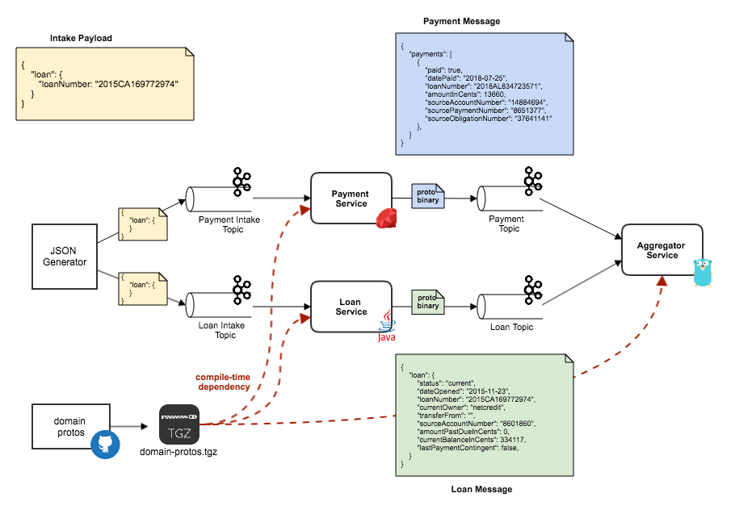

# protobuf_poc

This repo demonstrates Protobuf Serialization via Kafka topics & REST API between Java, Ruby & Go services.

## PoC Architecture



## To run the PoC services

Install Docker for Mac

#### Build domain protos

#### Start Kafka Infrastructure

From the root project dir,
```
//Starts Kafka infrastructure
docker-compose -f docker-compose-kafka.yml up
```

#### Start Services
Run each of the following in separate terminals for clear readability of application logs

```
//Starts the Java-based Loan Service
docker-compose up --build json-generator loan
```

```
//Starts the Rails-based Payment Service
docker-compose up --build payment
```

```
//Starts the Rails-based Loan Consumer & Payment Producer
docker-compose up --build loan_consumer payment_producer
```

```
//Starts the Go-based Aggregator Service
docker-compose up --build svc-aggregator
```
